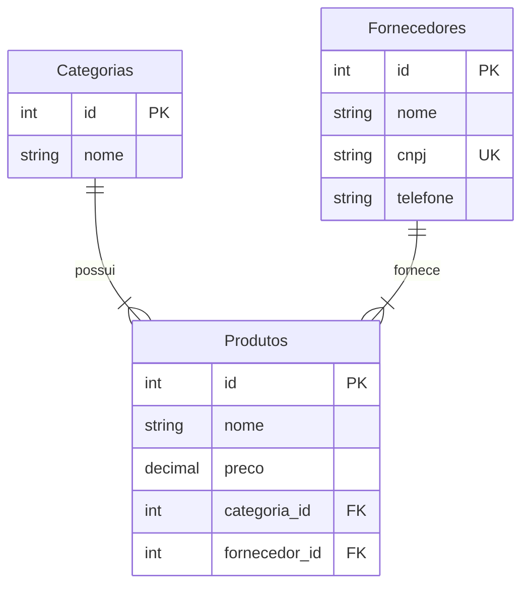

# 📦 Sistema de Controle de Estoque (CLI)

Um sistema de gerenciamento de estoque baseado em linha de comando (CLI), desenvolvido em Python. O projeto foca na aplicação de conceitos sólidos de Orientação a Objetos (POO) e separação de responsabilidades.

## 📋 Sobre o Projeto

Este sistema permite o controle completo do fluxo de mercadorias de um pequeno negócio. Ele gerencia o ciclo de vida dos produtos (cadastro, edição, exclusão) e controla o fluxo de inventário (entradas e saídas), mantendo a integridade dos dados através de validações em camadas.

## 🛠️ Tecnologias e Conceitos Utilizados

- **Linguagem:** Python 3
- **Paradigma:** Orientação a Objetos (Classes, Encapsulamento, Propriedades, Agregação)
- **Arquitetura:** Separação em Camadas (Model, Service, View/Main)
- **Tratamento de Erros:** Uso de try/except para garantir que o sistema não pare abruptamente

## 🚀 Possíveis Usos da Nossa Solução

Como este projeto pode impactar o mundo real? Aqui estão cenários onde essa solução se aplica:

### Microempreendedores e Varejo Local

**Cenário:** Uma loja de roupas de bairro ou uma papelaria que ainda usa caderno para anotar vendas.

**Solução:** O sistema digitaliza o inventário, permitindo saber exatamente quantas "Canetas Azuis" ou "Camisetas M" restam, evitando compras desnecessárias ou falta de produto.

### Gestão de Almoxarifado (TI ou Manutenção)

**Cenário:** Uma pequena empresa de TI que precisa controlar peças (cabos, mouses, teclados).

**Solução:** Controlar a saída de equipamentos para funcionários e saber quando repor o estoque de itens de consumo rápido.

### Controle de Insumos (Gastronomia)

**Cenário:** Uma lanchonete ou dark kitchen.

**Solução:** Cadastrar ingredientes (ex: farinha, tomate) e dar baixa conforme os pratos são preparados, auxiliando no controle de custos.

## ⚙️ Arquitetura e Justificativas

O projeto não é apenas um script único; ele foi dividido para facilitar a manutenção e escalabilidade:

### `model/`
Contém as classes que representam as entidades do negócio (Produto, Categoria, Fornecedor, Estoque).

**Justificativa:** Uso de Encapsulamento (@property e setters) para garantir que ninguém insira um preço negativo ou um nome vazio. A regra de negócio do dado vive aqui.

### `service/`
Contém a lógica de operações (EstoqueService).

**Justificativa:** O Produto não deve saber como se salvar ou se excluir. O Service age como um intermediário, garantindo que as operações de entrada/saída respeitem as regras do estoque.

### `main.py`
A interface com o usuário.

**Justificativa:** Mantém o código de interação (inputs/prints) separado da lógica de negócio. Se quisermos mudar para uma interface gráfica no futuro, a lógica principal não precisa ser reescrita.

---
## 🗄️ Projeto Físico de Banco de Dados


### 🛠️ Decisões Técnicas e Justificativas
1.  **Tipagem de Dados:**
    * **Preço (`DECIMAL(10,2)`):** Utilizado em vez de `FLOAT` para garantir precisão monetária e evitar erros de arredondamento em cálculos financeiros.
    * **CNPJ (`CHAR(14)`):** Definido como tamanho fixo para otimizar armazenamento, já que o padrão é constante.
2.  **Integridade e Restrições:**
    * **`CHECK (preco >= 0)`:** Restrição de segurança no nível do banco para impedir cadastro de preços negativos, independente da validação do software.
    * **`ON DELETE RESTRICT`:** Impede que uma Categoria ou Fornecedor seja excluído acidentalmente se houver produtos vinculados a eles.
3.  **Performance:**
    * Criação de índice (`idx_produto_nome`) na coluna nome do produto, visando acelerar a busca no PDV (Ponto de Venda), que é a operação mais frequente.

### 🎓 O que é Projeto Físico?
*Para estudantes iniciantes:*

Se o **Modelo Conceitual** é o esboço de um arquiteto e o **Lógico** é a planta baixa, o **Projeto Físico** é a construção real. É o momento onde traduzimos nossos diagramas para a linguagem que o computador entende (SQL).

É nesta etapa que decidimos questões vitais:
* **Segurança:** "O banco deve bloquear preços negativos?"
* **Eficiência:** "Qual o tipo de dado ocupa menos espaço?"
* **Velocidade:** "Como criar atalhos (índices) para achar dados rápido?"

Um bom projeto físico é o que diferencia um sistema lento e frágil de um sistema robusto e profissional.

## 💻 Como Rodar e Testar

### Pré-requisitos
- Ter o Python 3.x instalado

### Passo a Passo

1. Clone o repositório ou baixe os arquivos.

2. Organize as pastas da seguinte maneira:

```
/projeto
│   main.py
│
├── /model
│       categoria.py
│       fornecedor.py
│       produto.py
│       estoque.py
│
└── /service
        estoque_service.py
```

3. Abra o terminal na pasta do projeto e execute:

```bash
python main.py
```

## Roteiro de Teste (Exemplo de Uso)

Siga este fluxo para testar todas as funcionalidades:

### 1. Cadastros Iniciais
- Vá em `1 - Adicionar > 1 - Nova Categoria` > Cadastre "Eletrônicos"
- Vá em `1 - Adicionar > 2 - Novo Fornecedor` > Cadastre "Tech Vendas"

### 2. Criar Produto
- Vá em `1 - Adicionar > 3 - Novo Produto`
- Nome: "Mouse Gamer", Preço: 150.00
- Selecione a categoria e fornecedor criados anteriormente

### 3. Movimentação
- Vá em `1 - Adicionar > 4 - Entrada de Estoque` para adicionar mais unidades
- Vá em `2 - Remover > 4 - Saída de Estoque` para simular uma venda

### 4. Relatório
- Vá em `3 - Listar > 3 - Estoque Geral` e veja o saldo atualizado com os dados do fornecedor

### 5. Edição
- Vá em `4 - Editar > 2 - Editar Fornecedor` > Mude o nome para "Distribuidora Tech"
- Liste o estoque novamente e veja que o produto atualizou o nome do fornecedor automaticamente

## 🔮 Melhorias Futuras

- [ ] Implementar persistência de dados (Banco de Dados SQL ou JSON)
- [ ] Interface Gráfica (Desktop ou Web)
- [ ] Sistema de Login para diferentes usuários (Vendedor vs Gerente)

---